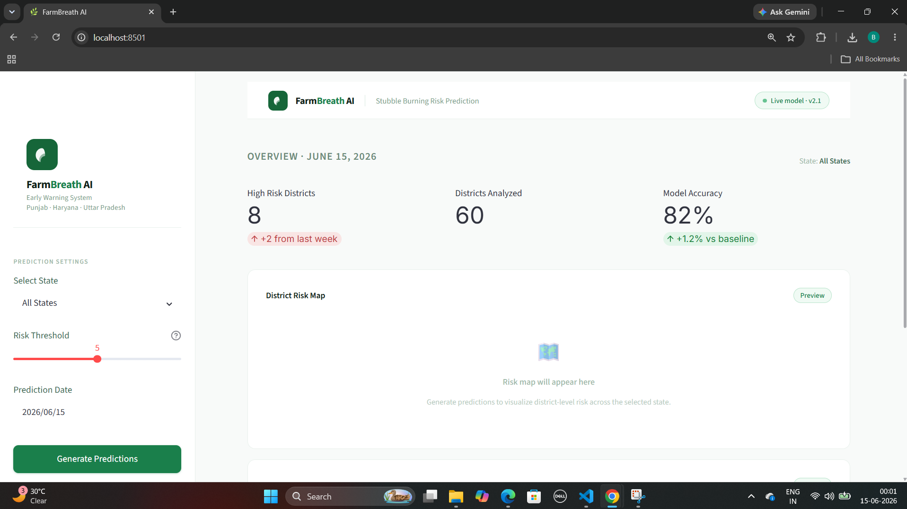
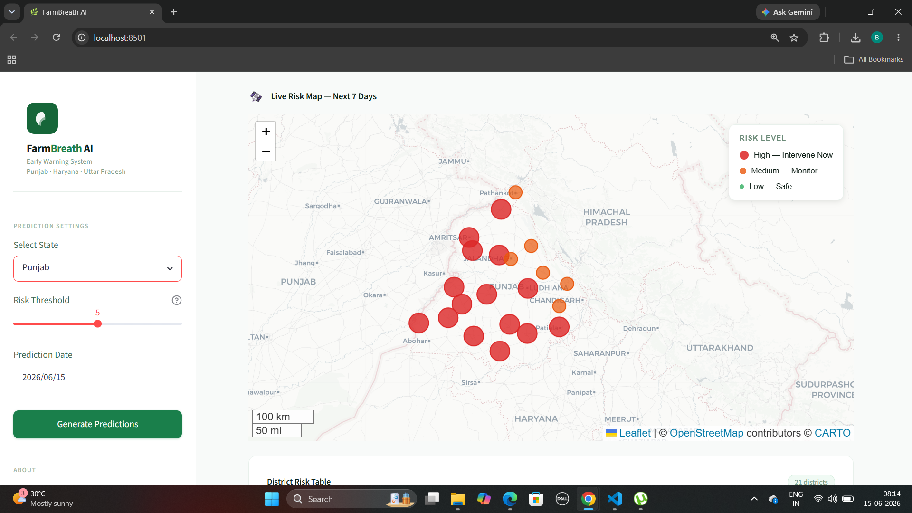
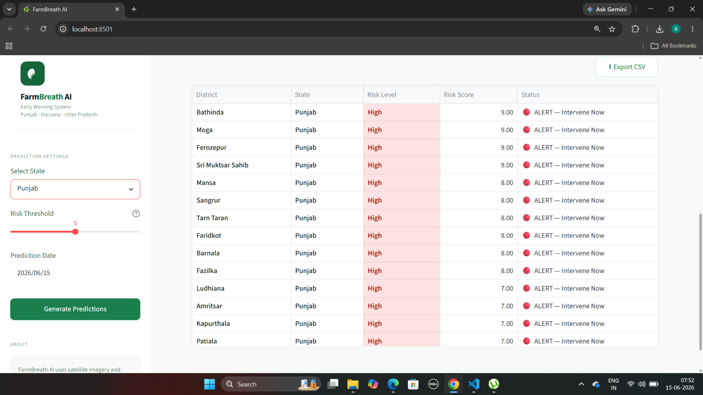
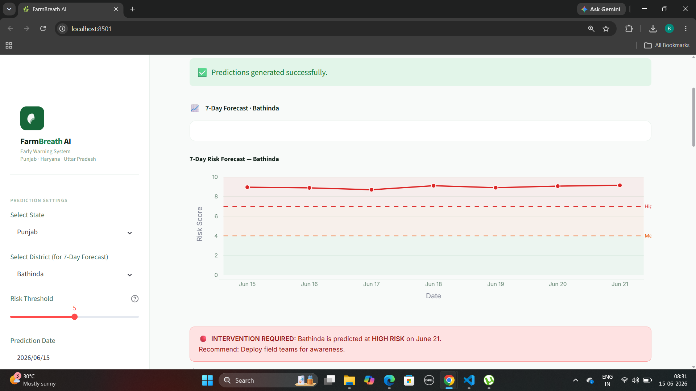
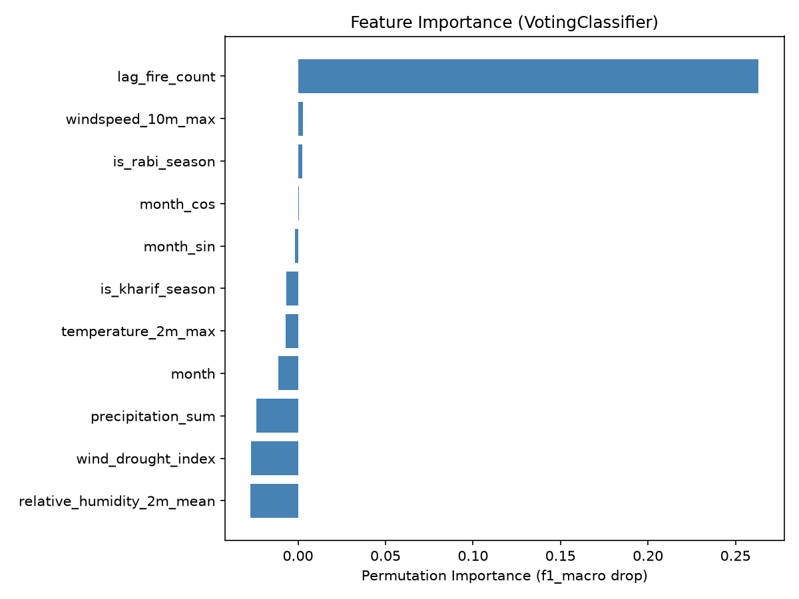
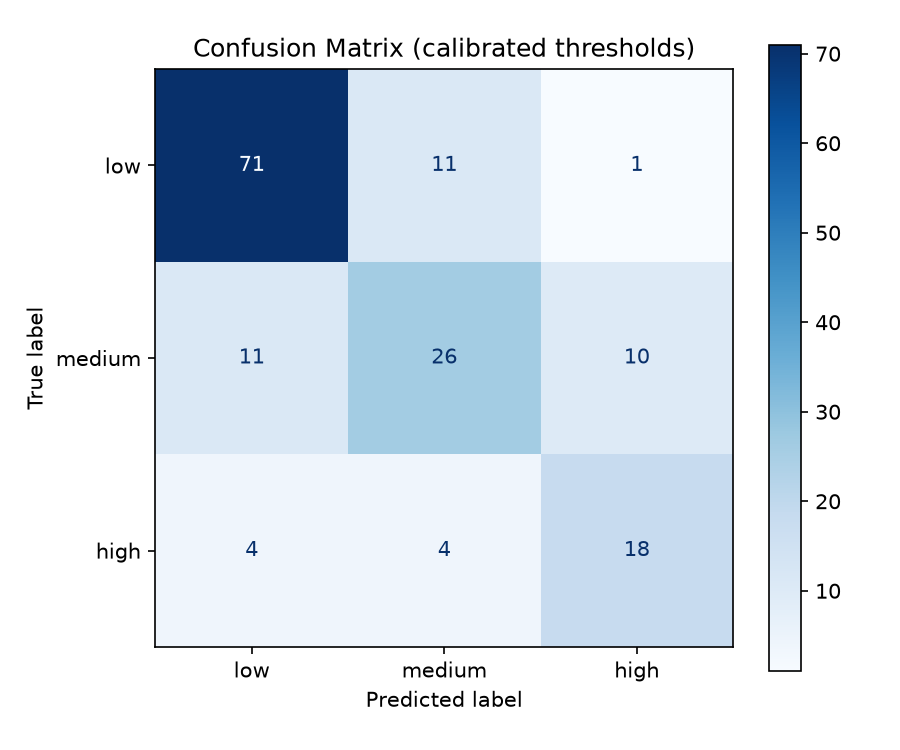

# 🌾 FarmBreath AI

### The smoke hasn't started yet. That's exactly when this matters.

**An early-warning system that predicts stubble-burning risk across Punjab, Haryana, and Uttar Pradesh — up to 7 days before a single field is set alight.**


---

## Table of Contents

- [The Problem](#the-problem)
- [What FarmBreath AI Actually Does](#what-farmbreath-ai-actually-does)
- [Why This, Not Just Another Fire Map](#why-this-not-just-another-fire-map)
- [Features](#features)
- [Architecture](#architecture)
- [Tech Stack](#tech-stack)
- [Project Structure](#project-structure)
- [Installation](#installation)
- [Configuration](#configuration)
- [Usage](#usage)
- [Screenshots](#screenshots)
- [Model Performance](#model-performance)
- [Future Scope](#future-scope)
- [Contributing](#contributing)
- [License](#license)
- [Acknowledgements](#acknowledgements)
- [Authors](#authors)
- [Contact](#contact)

---

## The Problem

Every October, the sky over North India starts to change color before the news does.

Across Punjab, Haryana, and western Uttar Pradesh, farmers burn millions of tonnes of paddy stubble each year to clear their fields fast — wheat sowing season doesn't wait. It's a rational decision under brutal time pressure: machinery to remove stubble properly is expensive, the sowing window is narrow, and fire is free. The result is one of the most predictable, recurring environmental crises in the world — and one of the least *anticipated*.

By the time satellites confirm a fire is burning, it's already burning. Existing monitoring tools — including the ones government agencies rely on — are detection systems, not prediction systems. They tell you what happened, not what's about to happen. Delhi-NCR's air quality crashes into "severe" territory every November partly because no one had a several-day head start to act.

FarmBreath AI exists to create that head start.

## What FarmBreath AI Actually Does

FarmBreath AI is a machine-learning dashboard that forecasts stubble-burning risk for 60 districts, days before ignition, using a model trained on historical satellite fire detections and fed by live weather data. Instead of asking "where is it burning right now," it asks the more useful question: *given this district's burning history, the calendar, and this week's wind and humidity, how likely is it to burn in the next seven days?*

It was built for the **Samsung Solve for Tomorrow** competition around one deliberate constraint: a small system that genuinely works beats a large system that merely demos well. Every feature here is something you can actually run, not something described in a slide.

## Why This, Not Just Another Fire Map

Most stubble-burning dashboards share the same blind spot: they're frozen in October-November mode, showing live risk year-round regardless of whether a burning season is actually happening. A risk map in February showing "low risk" everywhere isn't informative — it's just wrong context dressed up as data.

FarmBreath AI is **season-aware by design**. The dashboard knows what time of year it is and changes its entire behavior accordingly:

| When | What the dashboard does |
|---|---|
| **Sept (Pre-season)** | Surfaces early warning signals 30 days out, based on last year's patterns — the window where almost no other system says anything at all |
| **Oct–Nov (Kharif)** | Full live predictions, daily-refreshed risk map, 7-day forecasts per district |
| **Apr–May (Rabi)** | Secondary wheat-straw burning season — same engine, smaller scale, still tracked |
| **Rest of year (Off-season)** | No live risk shown. Instead: a season countdown and last year's summary, so the dashboard never lies to you about there being a fire risk when there isn't one |

That distinction — refusing to show a "live risk score" when there's nothing live to predict — is a small detail that says a lot about how the rest of the system was built.

## Features

- **Live district risk map** — an interactive Folium map showing real-time risk levels (low / medium / high) for every tracked district, color-coded with popups showing exact risk scores.
- **7-day forecast** — for any selected district, a forward-looking risk trend chart with high/medium/low threshold bands, so you can see not just *if* but *when* risk is expected to peak.
- **Seasonal awareness engine** — the dashboard automatically detects whether it's currently kharif season, rabi season, pre-season, or off-season, and changes its banner, map title, KPI cards, and available actions accordingly.
- **Historical analytics** — year-over-year fire trend charts, monthly burning pattern analysis, and an all-time district leaderboard.
- **Live weather integration** — pulls real 7-day forecasts from the Open-Meteo API per district to feed the prediction model, rather than relying on stale data.
- **Exportable risk tables** — district-level risk data can be downloaded as CSV directly from the dashboard, for teams who need to act on it outside the browser.

## Architecture

```
NASA FIRMS (MODIS fire data)        Open-Meteo (live weather)
            │                                  │
            ▼                                  ▼
   notebooks/clean_fire_data.py      model/predict.py
   notebooks/assign_districts.py     (fetches live forecast
   notebooks/create_master_dataset.py per district, builds
            │                          feature vector)
            ▼                                  │
     data/master_dataset.csv                   │
            │                                  │
            ▼                                  │
   model/train_model.py  ──────────────────────┤
   (RandomForestClassifier,                    │
    RandomizedSearchCV,                        │
    calibrated class thresholds)               │
            │                                  │
            ▼                                  ▼
   model/risk_predictor.pkl  ────────►  data/current_predictions.csv
   model/class_thresholds.pkl                  │
                                                ▼
                                     dashboard/app.py (Streamlit)
                                     dashboard/season_utils.py
                                                │
                                                ▼
                                        Live dashboard UI
```

The pipeline runs in three independent stages. **Data preparation** (`notebooks/`) cleans raw satellite fire detections and builds the training dataset — a one-time job, re-run only when source data changes. **Training** (`model/train_model.py`) turns that dataset into a saved model with calibrated decision thresholds. **Live prediction and presentation** (`model/predict.py` + `dashboard/app.py`) runs every time the dashboard loads, fetching fresh weather and rendering current risk on top of the already-trained model — no retraining needed to see today's numbers.

## Tech Stack

| Layer | Technology |
|---|---|
| Dashboard / UI | Streamlit, streamlit-folium |
| Mapping | Folium |
| Charts | Plotly |
| ML Model | scikit-learn (RandomForestClassifier + RandomizedSearchCV) |
| Data handling | pandas, numpy |
| Live weather | Open-Meteo API (no key required) |
| Historical fire data | NASA FIRMS (MODIS) |
| Model persistence | joblib |
| Imbalanced data handling | imbalanced-learn |

Exact pinned versions are in [`requirements.txt`](./requirements.txt).

## Project Structure

```
farmbreath_ai/
│
├── dashboard/
│   ├── app.py                  # Main Streamlit dashboard
│   └── season_utils.py         # Season-detection + banner logic
│
├── model/
│   ├── train_model.py          # Trains the RandomForest model
│   ├── predict.py              # Live prediction with weather fetch
│   ├── risk_predictor.pkl      # Trained model (tracked in repo so
│   │                           #   the dashboard works without retraining)
│   └── class_thresholds.pkl    # Calibrated per-class decision thresholds
│
├── data/
│   ├── current_predictions.csv # Latest model output, read by the dashboard
│   ├── districts.csv           # Master list of tracked districts
│   ├── district_coordinates.csv# Cached lat/lon per district
│   ├── fire_data.csv           # Raw NASA FIRMS fire detections
│   ├── fire_data_clean.csv     # Cleaned fire data
│   ├── fire_by_district.csv    # Fire incidents aggregated per district/month/year
│   ├── master_dataset.csv      # Final feature-engineered training dataset
│   └── weather_data.csv        # Historical weather data used in training
│
├── notebooks/
│   ├── download_weather.py     # Pulls historical weather for training
│   ├── clean_fire_data.py      # Cleans raw FIRMS data
│   ├── create_districts.py     # Builds the district reference list
│   ├── assign_districts.py     # Spatially joins fires to nearest district
│   ├── create_master_dataset.py# Joins fire + weather + season features
│   └── explore_fire_data.py    # Exploratory data analysis
│
├── samsung_submission/
│   └── problem_statement.txt   # Official competition problem statement
│
├── screenshots/                # Dashboard and model output screenshots
│
├── requirements.txt
├── LICENSE
├── CONTRIBUTING.md
├── .gitignore
└── README.md
```

## Installation

```bash
git clone https://github.com/brijeshearn12-dotcom/farmbreathai.git
cd farmbreathai

python -m venv .venv

# Windows
.venv\Scripts\activate
# macOS / Linux
source .venv/bin/activate

pip install -r requirements.txt
```

## Configuration

No environment variables or API keys are required to run the dashboard itself — live weather comes from Open-Meteo, which doesn't require authentication for the forecast endpoints used here.

If you re-run the data preparation notebooks in `notebooks/` to pull fresh NASA FIRMS satellite data from scratch, you may need a free FIRMS MAP_KEY (https://firms.modaps.eosdis.nasa.gov/api/). This is **not** required to run the dashboard with the already-included data and trained model.

## Usage

**Run the dashboard:**

```bash
streamlit run dashboard/app.py
```

This opens the dashboard in your browser, reading the latest predictions from `data/current_predictions.csv`.

**Regenerate predictions with live weather** (refreshes risk scores using the current date's weather forecast):

```bash
python model/predict.py
```

This overwrites `data/current_predictions.csv` with fresh predictions for every tracked district. Optionally pass a month number (1–12) as an argument to generate predictions for a specific month instead of the current one:

```bash
python model/predict.py 10
```

**Retrain the model from scratch** (only needed if you've changed the training data or features):

```bash
python model/train_model.py
```

## Screenshots

| | |
|---|---|
|  |  |
| Dashboard overview | Live district risk map |
|  |  |
| District risk table | 7-day forecast chart |
|  |  |
| Model feature importance | Model confusion matrix |

> Note: a couple of filenames in `screenshots/` currently have a duplicated `.png.png` extension (`day5_district_table.png.png`, `day7_forecast_chart.png.png`, `day2_fire_data_loaded.png.png`). The links above match the files exactly as they exist today, so they'll render correctly — but it's worth renaming them at some point for tidiness.

## Model Performance

The model is a `RandomForestClassifier` tuned via `RandomizedSearchCV`, trained on NASA FIRMS fire detections (2021–2025) joined with weather and seasonal features. Key engineered features include a wind/drought index, lagged fire counts per district, and cyclical month encoding — the kind of features that let the model learn *seasonality* rather than just memorizing which districts historically burn most.

Per-class decision thresholds (`model/class_thresholds.pkl`) are calibrated separately from raw argmax classification, since stubble-burning risk classes are naturally imbalanced — far more "low risk" district-days exist in the training data than "high risk" ones, and a model that just predicts "low" most of the time would score deceptively well on accuracy alone while being useless in practice.

See `screenshots/feature_importance.png` and `screenshots/confusion_matrix.png` for the model's feature importance ranking and classification performance breakdown.

## Future Scope

- Expand district coverage beyond Punjab, Haryana, and Uttar Pradesh to other stubble-burning-affected states.
- Add SMS/WhatsApp alerts for district administrators when high-risk predictions cross a threshold — so the warning reaches someone who can act on it, not just a browser tab.
- Integrate with state pollution control board dashboards for direct operational use.
- Add a lightweight mobile-friendly view for field teams without desktop access.
- Explore ensembling with satellite-derived smoke plume detection for same-day verification, closing the loop between prediction and confirmation.

## Contributing

Contributions are welcome — see [CONTRIBUTING.md](./CONTRIBUTING.md) for setup instructions and pull request guidelines.

## License

This project is licensed under the MIT License — see [LICENSE](./LICENSE) for details.

## Acknowledgements

- **NASA FIRMS** (Fire Information for Resource Management System) for satellite fire detection data.
- **Open-Meteo** for free, no-key-required weather forecast data.
- **Samsung Solve for Tomorrow** for the platform and challenge that motivated this project.

## Authors

**Brijesh Makwana** — Data Science & ML Pipeline
- Risk prediction model and feature engineering
- `current_predictions.csv` / `fire_by_district.csv` data pipeline
- Seasonal awareness engine (`dashboard/season_utils.py`) — season-state detection, dynamic banners, three-gate alert logic, and off-season historical fallback views
- Model accuracy validation and threshold tuning

**Gaurav Sharma** — Frontend & Dashboard
- Streamlit dashboard UI/UX (`dashboard/app.py`)
- Folium risk map and Plotly visualizations
- District/state filtering and 7-day forecast interface
- Styling, branding, and responsive layout

## Contact

For questions about this project, open an issue on this repository or reach out via the contact details in the Samsung Solve for Tomorrow submission.